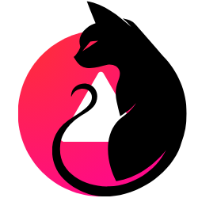
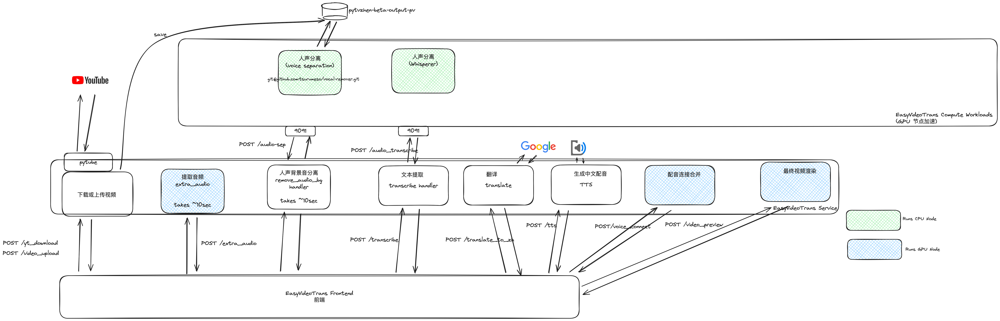

<div align="center"><a name="readme-top"></a>

<a href="https://github.com/sutro-planet/pytvzhen-web" target="_blank">
  
</a>

<h1><a href="https://github.com/sutro-planet/pytvzhen-web">EasyVideoTrans</a></h1>
<h3>
<a href="https://github.com/sutro-planet/pytvzhen-web">易用AI频翻译配音工具的web后端</a><br />
</h3>

<div style="text-align: center;">

[Changelog](./doc/change_log.md) <br>

[](https://qm.qq.com/q/pJMgV3liiO)


</div>

主要开发者
[](https://space.bilibili.com/278134)
[](https://x.com/zornlink)
[](https://space.bilibili.com/79912416)
[](https://space.bilibili.com/1557732)
[](https://space.bilibili.com/112484910)


</div>

# 简介

本项目着眼于从原始视频到翻译后最终视频的整个工作流程，确保从一而终的整个过程顺畅高效。项目提供了web后端和一个用于测试的前端页面

[本项目官方部署地址](https://easyvideotrans.com/), [项目Grafana监控仪表盘](https://grafana.sutroplanet.com/d/ee5da809-66e2-4498-9c9c-78a8ebf476a5/easyvideotrans-public?orgId=1)

本方案优势：

- 本方案使用模块化结构，提供 k8s 服务文件，可以在你的服务器（或者可爱的游戏本）上简单地进行 self-host
- 方案简单好用，经过验证，十分可靠，避免被巨量的不靠普方案迷惑，节约用户选择成本。<br>
- 翻译结果质量高，大幅减少人工校对。前期项目 <a href="https://github.com/CuSO4Gem/pytvzhen">pytvzhen</a>
  已经接受广大群友考验，倍受好评。<br>
- 方案开源可靠，免费使用。代码结构清晰，可读性强，可扩展性强，适合二次开发。

相关技术说明：
在 [技术关注&开发计划](#技术关注开发计划)
部分，我们列出了本方案的主要技术关注点，以及后续的开发计划。本项目重点强调易用、可靠、以及产生最终最终视频的速度。因此我们排除了大量不稳定、不可靠的方案，进保留整个工作流程中最好用的方案献给广大用户。

<p align="center">

</p>

# 相关项目介绍

* [easyvideotrans-frontend](https://github.com/sutro-planet/easyvideotrans-frontend)正式web前端
* [pytvzhen](https://github.com/CuSO4Gem/pytvzhen)离线客户端

* [https://easyvideotrans.com/](https://easyvideotrans.com/)在线版本

我们部署了一个 [在线版本](https://easyvideotrans.com/)，可以翻译长达60分钟油管或着任意自定义长度的视频，欢迎随时使用。你可以通过访问
[Grafana 图表](https://grafana.sutroplanet.com/d/ee5da809-66e2-4498-9c9c-78a8ebf476a5/easyvideotrans)
来了解该在线版本的健康情况。

# 部署

请先了解当前 EasyVideoTrans 项目架构



EasyVideoTrans 项目采用微服务架构，主要由三个 Docker 镜像组成：

* EasyVideoTrans 前端镜像
    * 功能：处理浏览器前端请求
    * Docker 镜像地址：`hanfa/pytvzhen-web:latest`
* EasyVideoTrans 服务镜像：
    * 功能：处理视频管理和基本的音频处理任务。
    * Docker 镜像地址：`hanfa/easyvideotrans:latest`
* EasyVideoTrans GPU 工作负载镜像：
    * 功能：专门用于处理需要 GPU 加速的音频分离和转录任务。
    * Docker 镜像地址：`hanfa/easyvideotrans-workloads:latest`

这种架构通过分离计算密集型任务和常规服务逻辑，优化了资源利用率和系统性能。

## K8s 部署（推荐）

K8s manifest 文件存于 [./k8s/prod](./k8s/prod) 目录，请确保你的集群至少有一个含有`nvidia.com/gpu: 1`的节点。

请全局搜索 `CHANGE ME` 然后自定义你的节点，PVC，以及其他资源的名称。

你可以轻易使用以下命令进行部署

```shell
kubectl apply -k ./k8s/prod
```

## Docker Compose 部署（推荐）

```shell
version: '3.8'

services:
  easyvideotrans-frontend:
    image: hanfa/pytvzhen-frontend:latest
    environment:
      - APP_ENV=prod
    ports:
      - "3000:3000"
    deploy:
      resources:
        limits:
          cpus: '4'
          memory: 2G
        reservations:
          cpus: '2'
          memory: 1G

  easyvideotrans:
    image: hanfa/easyvideotrans:latest
    environment:
      - CELERY_TASK_TIME_LIMIT=7200
      - CELERY_TASK_SOFT_TIME_LIMIT=3600
      - CELERY_METRICS_SERVER_PORT=8081
    ports:
      - "8080:8080"
      - "8081:8081"
    volumes:
      - easyvideotrans-output:/app/output

  rabbit-mq:
    image: rabbitmq:3.13-management
    ports:
      - "5672:5672"
      - "15672:15672"
      - "15692:15692"
    volumes:
      - rabbitmq-plugins:/etc/rabbitmq/enabled_plugins
      - rabbitmq-config:/etc/rabbitmq/rabbitmq.conf

  easyvideotrans-workloads:
    image: docker.io/hanfa/easyvideotrans-workloads:latest
    environment:
      - APP_ENV=production
      - OUTPUT_DIR=/app/static/outputs
    ports:
      - "8188:8188"
    deploy:
      resources:
        limits:
          cpus: '4'
          memory: 25G
          devices:
            - capabilities: [gpu]
        reservations:
          cpus: '2'
          memory: 10G
          devices:
            - capabilities: [gpu]
    volumes:
      - easyvideotrans-output:/app/workloads/static/outputs

volumes:
  easyvideotrans-output:
  rabbitmq-plugins:
    driver: local
    driver_opts:
      type: none
      device: ./rabbitmq/enabled_plugins
      o: bind
  rabbitmq-config:
    driver: local
    driver_opts:
      type: none
      device: ./rabbitmq/rabbitmq.conf
      o: bind
```

## 本地部署

以下操作可能过时，具体配环境请参考以下Dockerfile

* 前端 [Dockerfile for frontend](https://github.com/sutro-planet/easyvideotrans-frontend/blob/main/Dockerfile)
  for `hanfa/pytvzhen-web:latest`
* 服务层 [Dockerfile](./Dockerfile) for `hanfa/easyvideotrans:latest`
* GPU服务层 [Dockerfile-gpu-workload](./Dockerfile-gpu-workload) for `hanfa/easyvideotrans-workloads:latest`

### 环境准备

安装依赖需要：requirements.txt中的各种依赖，pythorch库，ffmpeg(可选)。本工程Python
3.9.19上验证。另外如果你想体验完整的工作流程，推荐下载一个字幕文件编辑器，尽管本程序用不到，但是在转换视频的工作中，你一定用得到，我使用Aegisub。

各种基本库安装
``
pip install -r requirements.txt
``

pytorch安装：
在[点击这里](https://pytorch.org/get-started/locally/)，选择合适的安装版本，**必须要选择gpu版！！！！**
原因是作者偷懒没有做cpu方案，其实如果你愿意，改几行源码实现在CPU上跑应该也不难。

其他依赖：

确保 RabbitMQ 作为broker在[./configs/celery.json](./configs/celery.json)里定义的`broker_url`运行，
具体方法参考[这里](https://www.rabbitmq.com/docs/download)，用`sudo rabbitmqctl status` 确保其正常运行。

ffmpeg安装

```
sudo apt-get install ffmpeg
```

[faster-whisper](https://github.com/SYSTRAN/faster-whisper/)下载自动模型的时候，国内可能会比较慢，甚至无法下载！！faster-whisper_models目录中，使得目录结构为：

```
faster-whisper_models
     |-models--Systran--faster-whisper-base.en
     |-models--Systran--faster-whisper-medium
     |-...
```

### 运行

0. 修改配置
   修改pytvzhen.json中的**VIDEO_MAX_DURATION**，配置下载视频的最大长度，单位为秒。

1. 在一个 terminal 里面启动 Celery 队列和 worker 来处理视频渲染请求。

`celery -A src.task_manager.celery_tasks.celery_app worker --concurrency 1 -Q video_preview`

2. 在另一个 terminal 里运行flask app。

```
flask run --host=0.0.0.0 --debug
```

然后浏览器打开http://127.0.0.1:5000.

# 技术关注&开发计划

后续计划：谨慎添加更多可靠的功能，增加其他语言到中文的翻译
| 项目名称 | 功能 | 当前状况 | 计划 |
| --- | --- | --- | --- |
| [whisper](https://github.com/openai/whisper)、[stable-whisper](https://github.com/jianfch/stable-ts)| 语言转字幕|
效果不如faster-whisper | 不添加 |
| [Funasr](https://gitcode.com/alibaba-damo-academy/FunASR/)| 语言转字幕| 还没验证 | 验证后再决策 |
| [GPT-SoVITS](https://github.com/RVC-Boss/GPT-SoVITS)| TTS | TTS输出不稳定 | 观望|
| [ChatTTS](https://github.com/2noise/ChatTTS) | TTS | TTS输出不稳定 | 观望 |
| [Open AI TTS](https://platform.openai.com/docs/guides/text-to-speech) | TTS | 要钱 | 后续添加 |
| [EmotiVoice](https://github.com/netease-youdao/EmotiVoice) | TTS | 不稳定 | 观望 |
| [StreamSpeech](https://github.com/ictnlp/StreamSpeech) | TTS | 还没验证 | 验证后再决策|
| 百度翻译、有道翻译、迅飞翻译 | 翻译 | 效果远不如谷歌 | 不添加 |
| [ChatGpt](https://chatgpt.com) | 翻译 | 效果不错 | 后续添加 |

# 主要上游开源项目

- [pytvzhen](https://github.com/CuSO4Gem/pytvzhen)
- [pytube](https://github.com/pytube/pytube)
- [ffmpeg](https://ffmpeg.org/)
- [faster-whisper](https://github.com/SYSTRAN/faster-whisper)
- [vocal-remover](https://github.com/tsurumeso/vocal-remover/releases)
- [srt](https://srt.readthedocs.io/en/latest/api.html)
- [pygtrans](https://github.com/foyoux/pygtrans)
- [edge-tts](https://github.com/hasscc/hass-edge-tts)
- [GPT-SoVITS](https://github.com/RVC-Boss/GPT-SoVITS)
- [moviepy](https://github.com/Zulko/moviepy)

